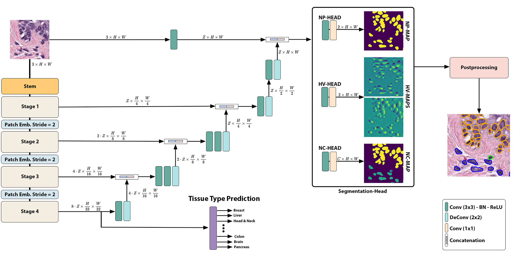
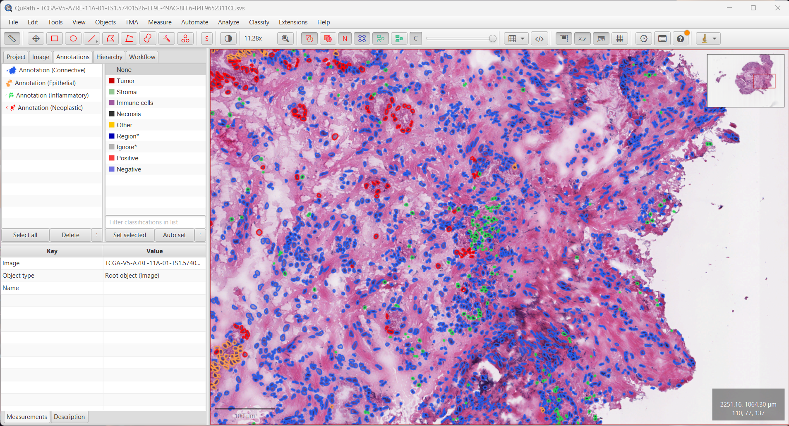

</a>
# NuLite - Lightweight and Fast Model for Nuclei Instance Segmentation and Classification
This repository contains the original **PyTorch** implementation of **NuLite.**

*Tommasino C., Russo C., Rianldi A.M. (2024). NuLite - Lightweight and Fast Model for Nuclei Instance Segmentation and Classification. https://doi.org/10.48550/ARXIV.2306.15350*



- State-of-the-Art Performance for lightweight model for nuclei instance segmentation and classification;
- The project uses FastViT;
- U-Net Architecture: NuLite is a U-Net-like encoder-decoder network;
- Fast Inference on Gigapixel WSI: the framework provides fast inference results by utilizing a large inference patch size of 1024X1024 pixels. This approach enables efficient analysis of Gigapixel Whole Slide Images (WSI) and generates localizable deep features that hold potential value for downstream tasks. We provide a fast inference pipeline with connection to current Viewing Software such as *QuPath* (inherited from
 [CellVIT](https://github.com/TIO-IKIM/CellViT)).

<div align="center">

[Features](#Features) • [Code Notes](#code-notes) •  [Repository Structure](#repository-structure) • [Datasets](#Datasets) • [Set Up Environment](#set-up-environment) • [Training](#training) • [Inference](#inference) •  [Inference Examples](#inference-example) • [Authors](#authors) • [Citation](#Citation)

</div>

## Features
* [x] Training
* [x] Tile Inference
* [x] WSI Inference

## Code Notes

>The training and inference code are taken from [CellVIT](https://github.com/TIO-IKIM/CellViT) repository.
> 
> The goal our this repository as well as the paper is to provide a lightweight model for nuclei instance segmentation and classification.
>

## Repository Structure

Below are the main directories in the repository: 

```bash
├── base_ml                  # Foundational machine learning utilities and base classes
├── models                   # Contains model definitions and architectures
│   ├── encoders             # FastViT implementation as encoder
├── nuclei_detection         # Nuclei detection-specific modules and scripts
│   ├── datamodel            # Data models or schemas for handling nuclei detection data
│   ├── datasets             # Datasets and data loaders for nuclei detection
│   ├── experiments          # Experiment scripts
│   ├── inference            # Scripts for model inference and predictions
│   ├── training             # Training scripts and configurations for nuclei detection models
│   ├── utils                # Utility functions for nuclei detection
├── utils                    # General utilities and helper functions used across the project
├── preprocessing            # Modules for preprocessing data before model inference
│   ├── encoding             # Data encoding and transformation modules
│   │   ├── datasets         # Encoded datasets or scripts handling the encoded data
│   └── patch_extraction     # Logic and scripts for extracting patches from WSI
│       ├── src              # Source code for patch extraction
│       │   ├── data         # Raw or processed data related to patch extraction
│       │   │   └── tissue_detector.pt   # Model file for detecting tissue areas
│       │   ├── utils        # Utilities specific to patch extraction
├── README.md                # Project overview and usage instructions
├── LICENSE                  # Legal terms for project usage and distribution
```

Below are the main executable scripts in the repository:

- `process_pannuke_dataset.py`: script to transform PanNuke dataset for knowledge distillation
- `train_nulite.py`: main training script for NuLite
- `run_inference_wsi.py`: main inference script for WSI
- `preprocessing/patch_extraction/main_extraction.py`: main script for patches extraction for WSI


## Datasets
- PanNuke [Fold1](https://warwick.ac.uk/fac/cross_fac/tia/data/pannuke/fold_1.zip), [Fold2](https://warwick.ac.uk/fac/cross_fac/tia/data/pannuke/fold_2.zip), [Fold3](https://warwick.ac.uk/fac/cross_fac/tia/data/pannuke/fold_3.zip) <br />
- CoNSeP [Download](https://warwick.ac.uk/fac/cross_fac/tia/data/hovernet/)
- MoNuSeg [Train](https://drive.google.com/file/d/1ZgqFJomqQGNnsx7w7QBzQQMVA16lbVCA/view) [Test](https://drive.google.com/file/d/1NKkSQ5T0ZNQ8aUhh0a8Dt2YKYCQXIViw/view)
- GlySAC [Download](https://drive.google.com/drive/folders/1p0Yt2w8MTcaZJU3bdh0fAtTrPWin1-zb)

## Set Up Environment

To run this code set up python environment as follows:

```bash
git clone https://github.com/DIAGNijmegen/NuLite.git
cd NuLite
python -m venv NuLite
source NuLite/bin/activate
pip install -r requirements.txt
```
We tested our code with `Python 3.8.10/3.10.8` and `Cuda 12`.

## Training
> **Note**
> 
> We used the training workflow provided by CellViT  removing the metrics computation during the training step, for any further information see [here](https://github.com/TIO-IKIM/CellViT/blob/main/README.md#traning).

To train the NuLite Network, use the `train_nulite.py` script from the command line interface (CLI). Below are the usage details and configuration requirements for running the script:

### Command Usage

```bash
usage: train_nulite.py [-h] --config CONFIG [--gpu GPU] | --checkpoint CHECKPOINT]
```

### Description

This script initiates an experiment using the specified configuration file.

#### Optional Arguments

- `-h, --help`: Display the help message and exit.
- `--gpu GPU`: Specify the CUDA-GPU ID to use (default is None).
- `--checkpoint CHECKPOINT`: Provide the path to a PyTorch checkpoint file. The training will resume from this checkpoint with the settings provided. Note that this parameter cannot be set within the configuration file (default is None).

#### Required Named Argument

- `--config CONFIG`: Specify the path to the configuration file (default is None).
An example configuration file is available at `configs_examples/traning_example.yaml`. 
We used the same dataset structure of CellViT for the PanNuke, for more detail see [here](https://github.com/TIO-IKIM/CellViT/blob/main/docs/readmes/pannuke.md).
The preparation script is in the [`nuclei_detection/datasets/`](nuclei_detection/datasets) folder.

## Inference

> **Note**
> 
> We used the inference provided by CellViT, for any further information see [here](https://github.com/TIO-IKIM/CellViT/blob/main/README.md#inference).


Model checkpoints are available for download here:
- [NuLite-H](https://zenodo.org/records/13167965)
- [NuLite-M](https://zenodo.org/records/13167892)
- [NuLite-T](https://zenodo.org/records/13167971)

License: [Apache 2.0 with Commons Clause](./LICENSE)

The provided checkpoints were trained on whole PanNuke dataset.

### Steps
To perform preprocessing, follow these steps:
1. Prepare WSI using our preprocessing pipeline.
2. Run inference with the [`inference/cell_detection.py`](/cell_segmentation/inference/cell_detection.py) script.

#### Cell detection script
To perform inference, use the [`cell_detection.py`](inference/cell_detection.py) script in the `cell_segmentation/inference` folder:

```bash
usage: run_wsi_inference.py --model MODEL [--gpu GPU] [--magnification MAGNIFICATION] [--mixed_precision]
                          [--batch_size BATCH_SIZE] [--outdir_subdir OUTDIR_SUBDIR]
                          [--geojson] {process_wsi,process_dataset} ...

Perform NuLite inference for given run-directory with model checkpoints and logs.

optional arguments:
  -h, --help            show this help message and exit
  --gpu GPU             CUDA-GPU ID for inference. Default: 0 (default: 0)
  --magnification MAGNIFICATION
                        Network magnification. Ensures correct resolution for the network. Default: 40 (default: 40)
  --mixed_precision     Use mixed precision for inference. Default: False (default: False)
  --batch_size BATCH_SIZE
                        Inference batch size. Default: 8 (default: 8)
  --outdir_subdir OUTDIR_SUBDIR
                        Creates a subdirectory in the cell_detection folder for storing results. Default: None (default: None)
  --geojson             Exports results as geojson files for use in software like QuPath. Default: False (default: False)

required named arguments:
  --model MODEL         Model checkpoint file for inference (default: None)

subcommands:
  Main command for performing inference on a single WSI file or an entire dataset.

  {process_wsi,process_dataset}
```
#### Single WSI
To process a single WSI file, use the `process_wsi` subcommand:
```bash
usage: cell_detection.py process_wsi --wsi_path WSI_PATH --patched_slide_path PATCHED_SLIDE_PATH

Process a single WSI file.

arguments:
  -h, --help            show this help message and exit
  --wsi_path WSI_PATH   Path to WSI file.
  --patched_slide_path PATCHED_SLIDE_PATH
                        Path to patched WSI file (specific WSI file, not parent path of patched slide dataset).
```
#### Multiple WSI
To process an entire dataset, use the `process_dataset` subcommand:
```bash
usage: cell_detection.py process_dataset  --wsi_paths WSI_PATHS --patch_dataset_path PATCH_DATASET_PATH [--filelist FILELIST] [--wsi_extension WSI_EXTENSION]

Process a whole dataset.

arguments:
  -h, --help            show this help message and exit
  --wsi_paths WSI_PATHS
                        Path to the folder containing all WSI.
  --patch_dataset_path PATCH_DATASET_PATH
                        Path to the folder containing the patch dataset.
  --filelist FILELIST   CSV file listing WSI to process. Each row should denote a filename (column named 'Filename'). If not provided, all WSI files with the given extension in the WSI folder are processed. Default: 'None'.
  --wsi_extension WSI_EXTENSION
                        The file extension for the WSI files, as defined in configs.python.config (WSI_EXT). Default: 'svs'.
```

### Inference Example
We provide an example TCGA file to show the performance and usage of our algorithms.
Files and scripts can be found in the [example](example) folder.
The TCGA slide must be downloaded here: https://portal.gdc.cancer.gov/files/f9147f06-2902-4a64-b293-5dbf9217c668.
Please place this file in the example folder.

```bash
python3 ./preprocessing/patch_extraction/main_extraction.py --config ./example/preprocessing_example.yaml
```

Output is stored inside `./example/output/preprocessing`

**Inference:**
Download the models and store them in `./models/pretrained` or on your preferred location and change the model parameter.

```bash
python3 ./cell_segmentation/inference/cell_detection.py \
  --model ./models/pretrained/NuLite/NuLite-H-Weights.pth\
  --gpu 0 \
  --geojson \
  process_wsi \
  --wsi_path ./example/TCGA-V5-A7RE-11A-01-TS1.57401526-EF9E-49AC-8FF6-B4F9652311CE.svs \
  --patched_slide_path ./example/output/preprocessing/TCGA-V5-A7RE-11A-01-TS1.57401526-EF9E-49AC-8FF6-B4F9652311CE
```
You can import your results (.geojson files) into [QuPath](https://qupath.github.io/). The results should look like this:
<div align="center">



</div>

## Citation

```
@article{tommasino2024nulite,
  title={NuLite - Lightweight and Fast Model for Nuclei Instance Segmentation and Classification},
  author={Tommasino, Cristian and Russo, Cristiano and Rinaldi, Antonio Maria},
  journal={arXiv preprint arXiv: 2408.01797},
  year={2024}
}
```

## References
<a id="1" href="https://doi.org/10.1016/j.media.2019.101563">[1]</a> 
Gamper, J., Alemi Koohbanani, N., Benet, K., Khuram, A., & Rajpoot, N. (2019). PanNuke: an open pan-cancer histology dataset for nuclei instance segmentation and classification. In Digital Pathology: 15th European Congress, ECDP 2019, Warwick, UK, April 10–13, 2019, Proceedings 15 (pp. 11-19). Springer International Publishing.

<a id="2" href="https://doi.org/10.1016/j.media.2019.101563">[2]</a>
Graham, S., Vu, Q. D., Raza, S. E. A., Azam, A., Tsang, Y. W., Kwak, J. T., & Rajpoot, N. (2019). Hover-net: Simultaneous segmentation and classification of nuclei in multi-tissue histology images. Medical image analysis, 58, 101563.

<a id="3" href="https://doi.org/10.1016/j.media.2024.103143">[2]</a>
Hörst, F., Rempe, M., Heine, L., Seibold, C., Keyl, J., Baldini, G., ... & Kleesiek, J. (2024). Cellvit: Vision transformers for precise cell segmentation and classification. Medical Image Analysis, 94, 103143.


## Authors
[Cristian Tommasino](https://github.com/cristian921)

## License

This project is licensed under the APACHE License 2.0 - see the [LICENSE](LICENSE) file for details. 

Note that the PanNuke dataset is licensed under [Attribution-NonCommercial-ShareAlike 4.0 International](http://creativecommons.org/licenses/by-nc-sa/4.0/), therefore the derived weights for NuLite are also shared under the same license. Please consider the implications of using the weights under this license on your work, and it's licensing. 
